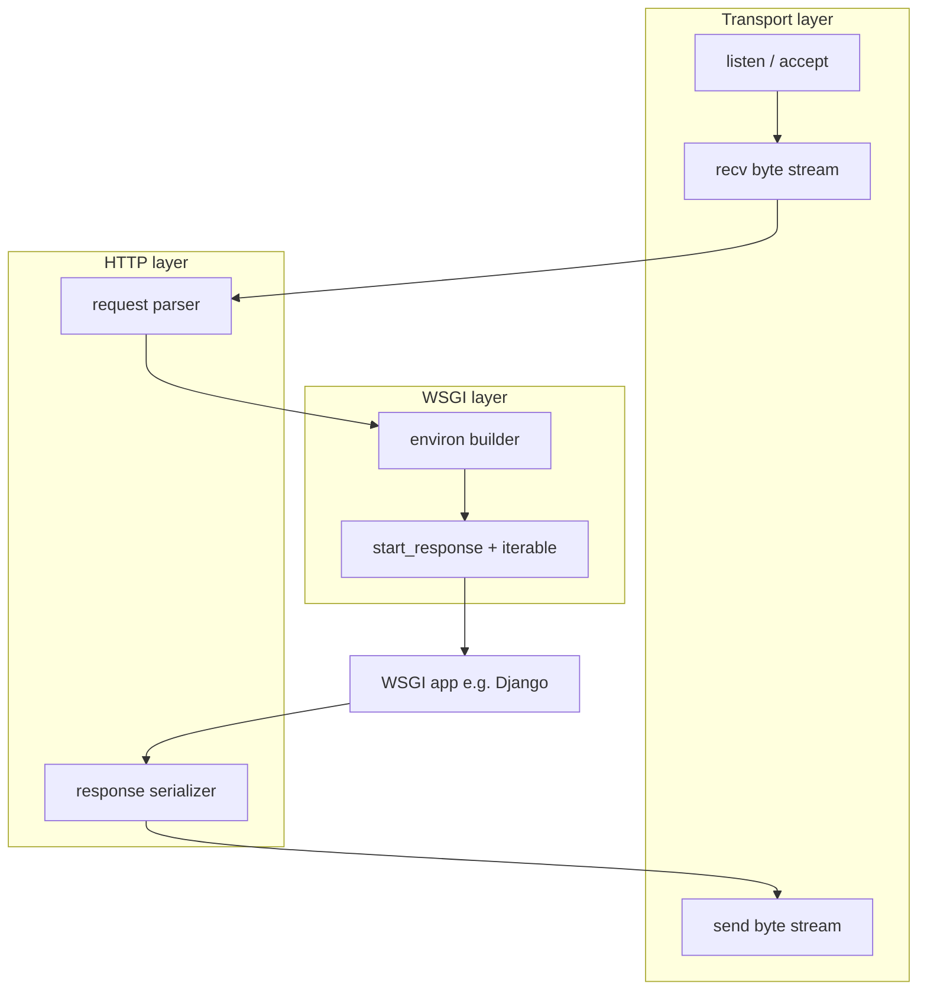

# pyserve

**Defense sentence:** This project implements everything between the TCP socket
and Django’s view function, by hand, in Python.

`pyserve` is an educational HTTP/1.1 WSGI server built from raw sockets — not a
replacement for nginx, gunicorn, uWSGI, uvicorn, or Apache.

## Clone and run in 3 commands

```powershell
python -m pip install -r requirements-all.txt -c constraints.txt
pyserve --app demo.trivial_app:application --host 127.0.0.1 --port 8000 --model serial
curl -i http://127.0.0.1:8000/
```

On Windows, if `pyserve` is not on `PATH`, use `python -m pyserve` instead of
`pyserve`.

## Architecture



Concurrency models (`serial`, `threaded`, `async`) share one dispatch policy and
swap only the transport implementation. See local `docs/adr/` for tradeoffs.

## Quick start (library)

```python
from pyserve import WSGIServer
from demo.trivial_app import application

server = WSGIServer(application, host="127.0.0.1", port=8000, model="threaded")
server.run()
```

## Configuration

- **CLI flags** — see table below.
- **TOML file** — copy `serve.toml`, then run `pyserve --config serve.toml --app ...`.
- **Optional middleware** (via CLI or TOML):
  - `--stats-path /_pyserve/stats` — JSON stats for HTMX dashboards
  - `--static demo/public` — serve static files with `304` support
  - `--access-log-clf` — Common Log Format access lines

## What is implemented

- Raw TCP listener (`socket`, `bind`, `listen`, `accept`)
- HTTP/1.1 parser and serializer with enforced limits
- PEP 3333 WSGI adapter (`wsgiref.validate`, Django proof)
- Serial, threaded, and asyncio models
- Bounded keep-alive, access logging, in-process stats
- CLI and importable `WSGIServer` API

Full implementation, tests, ADRs, and demo materials live in the local
`src/`, `tests/`, `demo/`, and `docs/` directories (not published to GitHub).

## Documentation map (local)

| Path | Purpose |
| --- | --- |
| `docs/capstone-report.md` | Final written report |
| `docs/defense-questions.md` | 17 oral-defense prompts with answers |
| `docs/demo-rehearsal.md` | Live demo checklist |
| `docs/demo-script.md` | Step-by-step demo commands |
| `docs/benchmark-results.md` | Concurrency benchmark numbers |
| `docs/adr/README.md` | Architecture decision records |
| `docs/production-reflection.md` | Production non-goals |
| `docs/submission-checklist.md` | Course submission packaging |

## CLI options (summary)

| Option | Default | Meaning |
| --- | --- | --- |
| `--app` | (required) | WSGI app as `import.path:callable` |
| `--config` | — | Optional TOML config (`serve.toml`) |
| `--host` / `--port` | `127.0.0.1` / `8000` | Bind address |
| `--model` | `serial` | `serial`, `threaded`, or `async` |
| `--workers` | `8` | Thread pool / async WSGI executor size |
| `--access-log` | off | Per-request access log lines |
| `--access-log-clf` | off | Common Log Format |
| `--stats-path` | — | JSON stats endpoint |
| `--static` | — | Static file root directory |
| `--benchmark-friendly` | off | Disable keep-alive for benchmarks |

See local source `src/pyserve/cli/main.py` for the full list.

## Install

```powershell
python -m pip install -r requirements-all.txt -c constraints.txt
python -m pytest
```

## Scope boundary

TLS, HTTP/2+, WebSockets, reverse proxying, chunked transfer, and production
hardening are intentional non-goals. See `docs/production-reflection.md`.

## Releases

Current version: **v0.2.1**. See `CHANGELOG.md` and local `RELEASE_v0.2.1.md`
for release notes. Tags are created locally; nothing is pushed to GitHub unless
you choose to.
